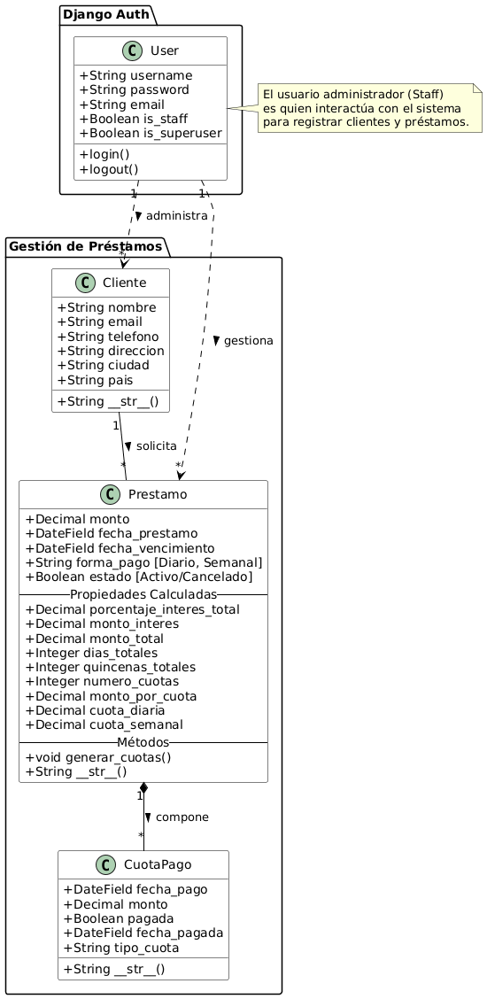
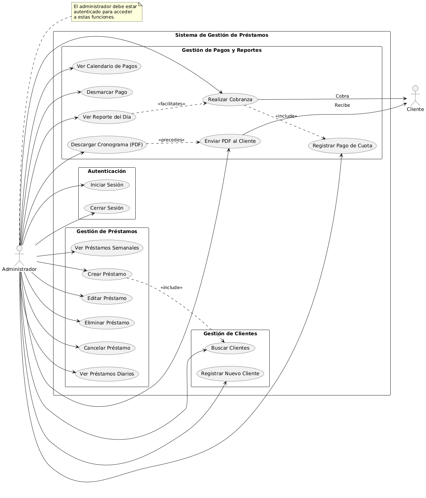
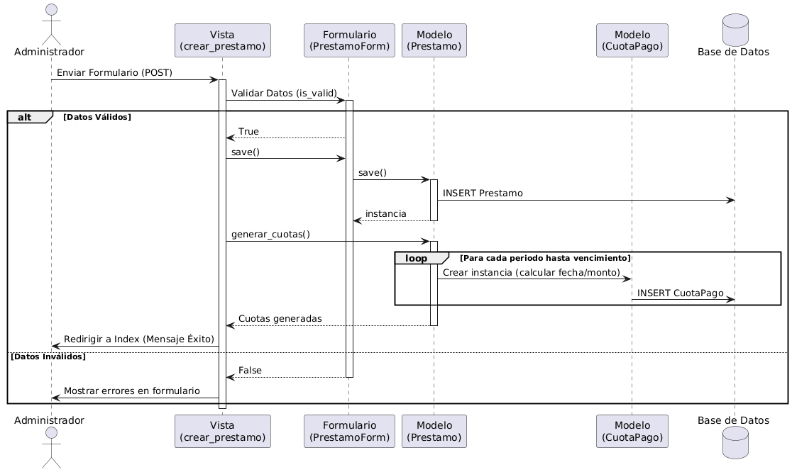
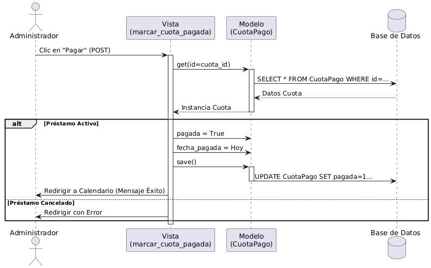

# Sistema de Gestión de Préstamos

Este proyecto es una aplicación web desarrollada en Django para la gestión de préstamos, clientes y control de pagos. Permite administrar préstamos diarios y semanales, generar calendarios de pagos, y realizar un seguimiento de las cuotas.

## 🛠️ Tecnologías Utilizadas

*   **Backend:** Python 3.13, Django 5.2.5
*   **Base de Datos:**
    *   Desarrollo: SQLite
    *   Producción: MySQL (vía Railway)
*   **Servidor Web:** Gunicorn
*   **Archivos Estáticos:** Whitenoise
*   **Generación de PDF:** ReportLab
*   **Frontend:** HTML5, CSS3, JavaScript (Django Templates)
*   **Despliegue:** Render.com

## 🚀 Cómo se Creó

El proyecto fue construido siguiendo la arquitectura MVT (Modelo-Vista-Template) de Django:

1.  **Configuración Inicial:** Se inició un proyecto Django estándar (`gestion_prestamos`) y una aplicación principal (`prestamos`).
2.  **Modelado de Datos:** Se definieron modelos para `Cliente`, `Prestamo` y `CuotaPago` para manejar la lógica de negocio.
3.  **Lógica de Negocio:** Se implementaron métodos en los modelos para cálculos automáticos de intereses, fechas de vencimiento y generación de cuotas.
4.  **Vistas y Controladores:** Se crearon vistas basadas en funciones para manejar las interacciones del usuario (CRUD de préstamos, clientes, pagos).
5.  **Seguridad:** Se utilizó el sistema de autenticación de Django para proteger las rutas.

## 📊 Diagramas UML

### Diagrama de Clases

Este diagrama muestra la estructura de datos del sistema y cómo interactúan los modelos principales con el usuario administrador.



### Diagrama de Casos de Uso

Este diagrama ilustra las interacciones del usuario (Administrador) con las diferentes funcionalidades del sistema, incluyendo la interacción con el Cliente.



### Diagramas de Secuencia

#### 1. Creación de un Préstamo

Muestra el flujo desde que el administrador envía el formulario hasta que se generan las cuotas.



#### 2. Registro de Pago de Cuota

Muestra cómo el sistema procesa el pago de una cuota específica.



## 💻 Ejecución Local

Para ejecutar el proyecto en tu máquina local:

1.  **Clonar el repositorio:**
    ```bash
    git clone <url-del-repo>
    cd prestamos
    ```

2.  **Crear y activar entorno virtual:**
    ```bash
    python -m venv venv
    # Windows
    .\venv\Scripts\activate
    # Linux/Mac
    source venv/bin/activate
    ```

3.  **Instalar dependencias:**
    ```bash
    pip install -r requirements.txt
    ```

4.  **Configurar variables de entorno:**
    Crea un archivo `.env` en la raíz (puedes usar `.env.example` como guía).

5.  **Aplicar migraciones:**
    ```bash
    python manage.py migrate
    ```

6.  **Crear superusuario:**
    ```bash
    python manage.py createsuperuser
    ```

7.  **Ejecutar servidor:**
    ```bash
    python manage.py runserver
    ```

## ☁️ Despliegue (Deployment)

El proyecto está configurado para desplegarse en **Render.com** utilizando el archivo `render.yaml`.

### Configuración de Render
*   **Build Command:** `./build_render_final.sh`
*   **Start Command:** `gunicorn gestion_prestamos.wsgi:application`
*   **Variables de Entorno:**
    *   `PYTHON_VERSION`: 3.13.4
    *   `DATABASE_URL`: (Proporcionada por Render PostgreSQL)
    *   `SECRET_KEY`: (Generada automáticamente)
    *   `DEBUG`: False

### Script de Construcción (`build_render_final.sh`)
El script se encarga de:
1.  Instalar dependencias (`pip install -r requirements.txt`).
2.  Ejecutar migraciones (`python manage.py migrate`).
3.  Recopilar archivos estáticos (`python manage.py collectstatic`).
4.  Crear un superusuario por defecto si no existe (útil para el primer despliegue).
