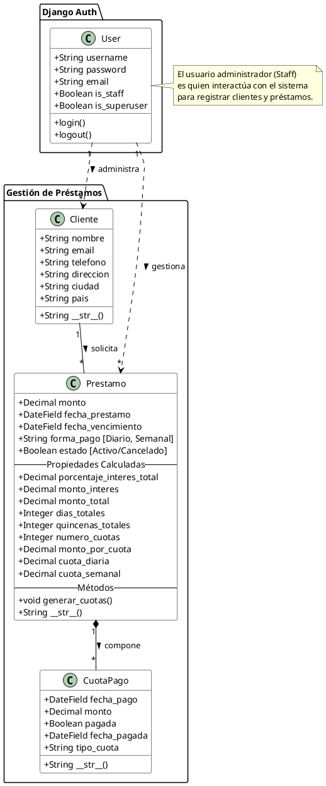
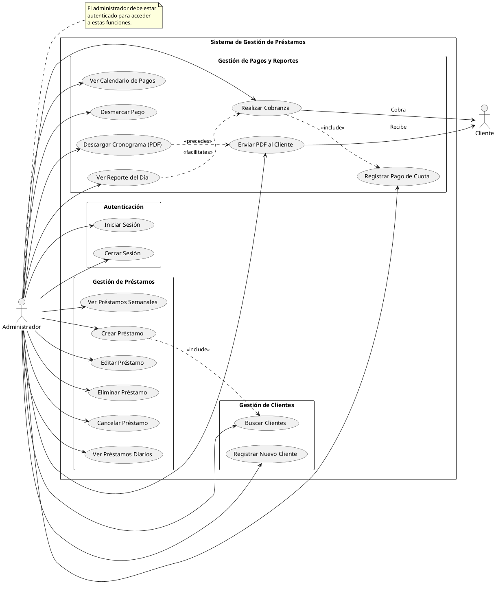
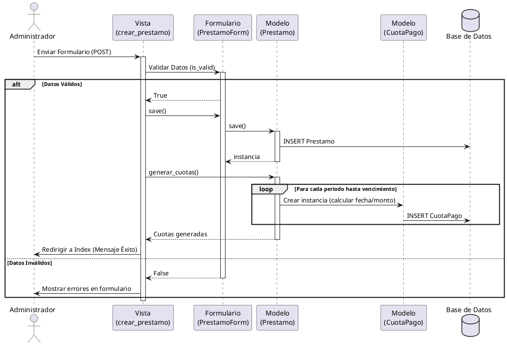
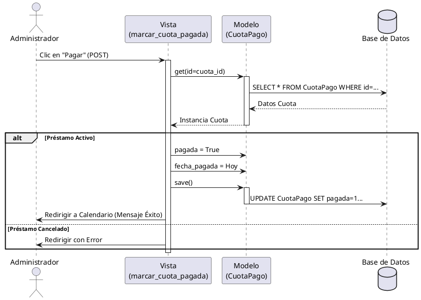

# Sistema de Gestión de Préstamos

Este proyecto es una aplicación web desarrollada en Django para la gestión de préstamos, clientes y control de pagos. Permite administrar préstamos diarios y semanales, generar calendarios de pagos, y realizar un seguimiento de las cuotas.

## 🛠️ Tecnologías Utilizadas

*   **Backend:** Python 3.13, Django 5.2.5
*   **Base de Datos:**
    *   Desarrollo: SQLite
    *   Producción: PostgreSQL (vía Render)
*   **Servidor Web:** Gunicorn
*   **Archivos Estáticos:** Whitenoise
*   **Generación de PDF:** ReportLab
*   **Frontend:** HTML5, CSS3, JavaScript (Django Templates)
*   **Despliegue:** Render.com

## 🚀 Cómo se Creó

El proyecto fue construido siguiendo la arquitectura MVT (Modelo-Vista-Template) de Django:

1.  **Configuración Inicial:** Se inició un proyecto Django estándar (`gestion_prestamos`) y una aplicación principal (`prestamos`).
2.  **Modelado de Datos:** Se definieron modelos para `Cliente`, `Prestamo` y `CuotaPago` para manejar la lógica de negocio.
3.  **Lógica de Negocio:** Se implementaron métodos en los modelos para cálculos automáticos de intereses, fechas de vencimiento y generación de cuotas.
4.  **Vistas y Controladores:** Se crearon vistas basadas en funciones para manejar las interacciones del usuario (CRUD de préstamos, clientes, pagos).
5.  **Seguridad:** Se utilizó el sistema de autenticación de Django para proteger las rutas.

## 📊 Diagramas UML

### Diagrama de Clases

Este diagrama muestra la estructura de datos del sistema y cómo interactúan los modelos principales con el usuario administrador.


```plantuml
@startuml
skinparam classAttributeIconSize 0
skinparam class {
    BackgroundColor White
    ArrowColor Black
    BorderColor Black
}

package "Django Auth" {
    class User {
        +String username
        +String password
        +String email
        +Boolean is_staff
        +Boolean is_superuser
        +login()
        +logout()
    }
}

package "Gestión de Préstamos" {
    class Cliente {
        +String nombre
        +String email
        +String telefono
        +String direccion
        +String ciudad
        +String pais
        +String __str__()
    }

    class Prestamo {
        +Decimal monto
        +DateField fecha_prestamo
        +DateField fecha_vencimiento
        +String forma_pago [Diario, Semanal]
        +Boolean estado [Activo/Cancelado]
        -- Propiedades Calculadas --
        +Decimal porcentaje_interes_total
        +Decimal monto_interes
        +Decimal monto_total
        +Integer dias_totales
        +Integer quincenas_totales
        +Integer numero_cuotas
        +Decimal monto_por_cuota
        +Decimal cuota_diaria
        +Decimal cuota_semanal
        -- Métodos --
        +void generar_cuotas()
        +String __str__()
    }

    class CuotaPago {
        +DateField fecha_pago
        +Decimal monto
        +Boolean pagada
        +DateField fecha_pagada
        +String tipo_cuota
        +String __str__()
    }
}

' Relaciones
User "1" ..> "*" Cliente : administra >
User "1" ..> "*" Prestamo : gestiona >
Cliente "1" -- "*" Prestamo : solicita >
Prestamo "1" *-- "*" CuotaPago : compone >

note right of User
  El usuario administrador (Staff)
  es quien interactúa con el sistema
  para registrar clientes y préstamos.
end note

@enduml
```

### Diagrama de Casos de Uso

Este diagrama ilustra las interacciones del usuario (Administrador) con las diferentes funcionalidades del sistema, incluyendo la interacción con el Cliente.


```plantuml
@startuml
left to right direction
skinparam packageStyle rectangle

actor "Administrador" as Admin
actor "Cliente" as Client

package "Sistema de Gestión de Préstamos" {
    
    package "Autenticación" {
        usecase "Iniciar Sesión" as UC_Login
        usecase "Cerrar Sesión" as UC_Logout
    }

    package "Gestión de Clientes" {
        usecase "Registrar Nuevo Cliente" as UC_RegCliente
        usecase "Buscar Clientes" as UC_BuscarCliente
    }

    package "Gestión de Préstamos" {
        usecase "Crear Préstamo" as UC_CrearPrestamo
        usecase "Editar Préstamo" as UC_EditarPrestamo
        usecase "Eliminar Préstamo" as UC_EliminarPrestamo
        usecase "Cancelar Préstamo" as UC_CancelarPrestamo
        usecase "Ver Préstamos Diarios" as UC_VerDiarios
        usecase "Ver Préstamos Semanales" as UC_VerSemanales
    }

    package "Gestión de Pagos y Reportes" {
        usecase "Ver Calendario de Pagos" as UC_Calendario
        usecase "Registrar Pago de Cuota" as UC_PagarCuota
        usecase "Desmarcar Pago" as UC_DesmarcarPago
        usecase "Descargar Cronograma (PDF)" as UC_PDF
        usecase "Enviar PDF al Cliente" as UC_EnviarPDF
        usecase "Ver Reporte del Día" as UC_Reporte
        usecase "Realizar Cobranza" as UC_Cobranza
    }
}

' Relaciones de Autenticación
Admin --> UC_Login
Admin --> UC_Logout

' Relaciones de Gestión
Admin --> UC_RegCliente
Admin --> UC_BuscarCliente
UC_CrearPrestamo ..> UC_BuscarCliente : <<include>>

Admin --> UC_CrearPrestamo
Admin --> UC_EditarPrestamo
Admin --> UC_EliminarPrestamo
Admin --> UC_CancelarPrestamo
Admin --> UC_VerDiarios
Admin --> UC_VerSemanales

' Relaciones de Pagos
Admin --> UC_Calendario
Admin --> UC_PagarCuota
Admin --> UC_DesmarcarPago
Admin --> UC_PDF
Admin --> UC_Reporte

' Nuevas interacciones con Cliente
Admin --> UC_EnviarPDF
UC_PDF ..> UC_EnviarPDF : <<precedes>>
UC_EnviarPDF ---> Client : Recibe

Admin --> UC_Cobranza
UC_Reporte ..> UC_Cobranza : <<facilitates>>
UC_Cobranza ---> Client : Cobra
UC_Cobranza ..> UC_PagarCuota : <<include>>

note right of Admin
  El administrador debe estar
  autenticado para acceder
  a estas funciones.
end note

@enduml
```

### Diagramas de Secuencia

#### 1. Creación de un Préstamo

Muestra el flujo desde que el administrador envía el formulario hasta que se generan las cuotas.


```plantuml
@startuml
actor Administrador
participant "Vista\n(crear_prestamo)" as View
participant "Formulario\n(PrestamoForm)" as Form
participant "Modelo\n(Prestamo)" as Prestamo
participant "Modelo\n(CuotaPago)" as Cuota
database "Base de Datos" as DB

Administrador -> View: Enviar Formulario (POST)
activate View
View -> Form: Validar Datos (is_valid)
activate Form

alt Datos Válidos
    Form --> View: True
    View -> Form: save()
    Form -> Prestamo: save()
    activate Prestamo
    Prestamo -> DB: INSERT Prestamo
    Prestamo --> Form: instancia
    deactivate Prestamo
    
    View -> Prestamo: generar_cuotas()
    activate Prestamo
    loop Para cada periodo hasta vencimiento
        Prestamo -> Cuota: Crear instancia (calcular fecha/monto)
        Cuota -> DB: INSERT CuotaPago
    end
    Prestamo --> View: Cuotas generadas
    deactivate Prestamo
    
    View -> Administrador: Redirigir a Index (Mensaje Éxito)
else Datos Inválidos
    Form --> View: False
    deactivate Form
    View -> Administrador: Mostrar errores en formulario
end
deactivate View
@enduml
```

#### 2. Registro de Pago de Cuota

Muestra cómo el sistema procesa el pago de una cuota específica.


```plantuml
@startuml
actor Administrador
participant "Vista\n(marcar_cuota_pagada)" as View
participant "Modelo\n(CuotaPago)" as Cuota
database "Base de Datos" as DB

Administrador -> View: Clic en "Pagar" (POST)
activate View

View -> Cuota: get(id=cuota_id)
activate Cuota
Cuota -> DB: SELECT * FROM CuotaPago WHERE id=...
DB --> Cuota: Datos Cuota
Cuota --> View: Instancia Cuota
deactivate Cuota

alt Préstamo Activo
    View -> Cuota: pagada = True
    View -> Cuota: fecha_pagada = Hoy
    View -> Cuota: save()
    activate Cuota
    Cuota -> DB: UPDATE CuotaPago SET pagada=1...
    deactivate Cuota
    
    View -> Administrador: Redirigir a Calendario (Mensaje Éxito)
else Préstamo Cancelado
    View -> Administrador: Redirigir con Error
end

deactivate View
@enduml
```

## 💻 Ejecución Local

Para ejecutar el proyecto en tu máquina local:

1.  **Clonar el repositorio:**
    ```bash
    git clone <url-del-repo>
    cd prestamos
    ```

2.  **Crear y activar entorno virtual:**
    ```bash
    python -m venv venv
    # Windows
    .\venv\Scripts\activate
    # Linux/Mac
    source venv/bin/activate
    ```

3.  **Instalar dependencias:**
    ```bash
    pip install -r requirements.txt
    ```

4.  **Configurar variables de entorno:**
    Crea un archivo `.env` en la raíz (puedes usar `.env.example` como guía).

5.  **Aplicar migraciones:**
    ```bash
    python manage.py migrate
    ```

6.  **Crear superusuario:**
    ```bash
    python manage.py createsuperuser
    ```

7.  **Ejecutar servidor:**
    ```bash
    python manage.py runserver
    ```

## ☁️ Despliegue (Deployment)

El proyecto está configurado para desplegarse en **Render.com** utilizando el archivo `render.yaml`.

### Configuración de Render
*   **Build Command:** `./build_render_final.sh`
*   **Start Command:** `gunicorn gestion_prestamos.wsgi:application`
*   **Variables de Entorno:**
    *   `PYTHON_VERSION`: 3.13.4
    *   `DATABASE_URL`: (Proporcionada por Render PostgreSQL)
    *   `SECRET_KEY`: (Generada automáticamente)
    *   `DEBUG`: False

### Script de Construcción (`build_render_final.sh`)
El script se encarga de:
1.  Instalar dependencias (`pip install -r requirements.txt`).
2.  Ejecutar migraciones (`python manage.py migrate`).
3.  Recopilar archivos estáticos (`python manage.py collectstatic`).
4.  Crear un superusuario por defecto si no existe (útil para el primer despliegue).
